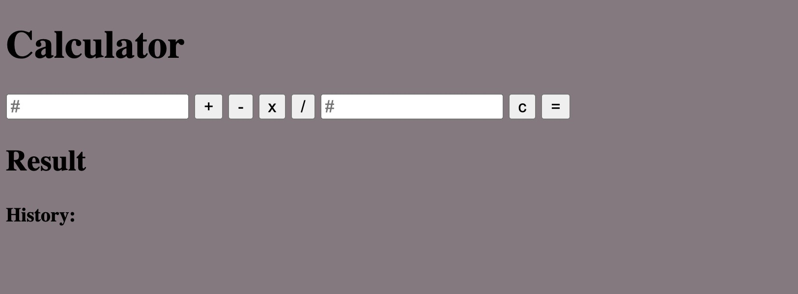
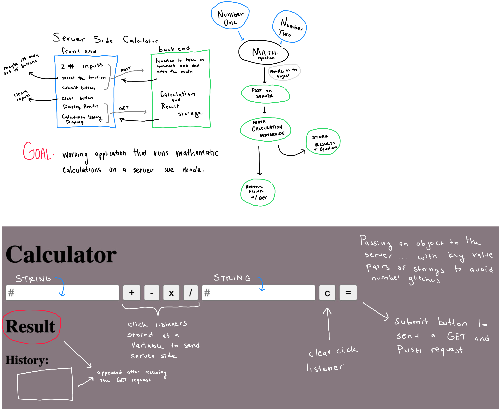

(View Raw will give you the markdown that you can copy to your repos!)

# Server Side Calculator

## Description

_Duration: 24 hour Sprint_

Over the course of a weekend - we were tasked with creating a functional calculator (from scratch) that handled all of the calculations on the server we created. 

## Screen Shot

This is the prototype of the assignment - a simple set of inputs and math selectors to function as a calculator. This was easily completed within the first few hours of the assignment - but wasn't visually appealing.

This is the calculator portion of the Final Product - as you can see it is a complete transformation of the structure ... which also required some logic restructuring in the javascript. In order to make it slightly more interesting to me - I added a pokemon theme / color scheme to spice up the assignment!

## Description & Approach

As I continue to develop my personal workflow - I am trying to get into the habit of breaking down the complexity of the project at hand. One way I do this is by making a visual To-Do list / Flow Chart for me to follow. (like the one above)

Approaching the base mode of this assignment was easy enough - setting up input fields and connecting them to javascript functions that would be sent using POST requests to the server. From here - I made a function to handle the object transported server-side and stored results that could be retrieved by the users GET request. 

### Prerequisites
- [Node.js](https://nodejs.org/en/)
- Express 
- Body-Parser

## Installation
1. Clone this repository for your own access.
2. Open up your editor of choice and run an `npm install`
3. Run `npm run server` in your terminal
4. Navigate to http://localhost:5000/

## Usage
This web application is meant to function similar to a calculator in real life:
1. Press buttons to input your first number
2. Select a single math equation
3. Press buttons to input your second number
4. Press "="
5. See the answer on the calculator screen OR down below in the history section!

## Acknowledgement
Thanks to [Prime Digital Academy](www.primeacademy.io) who equipped and helped me to make this application a reality. (Thank your people)
